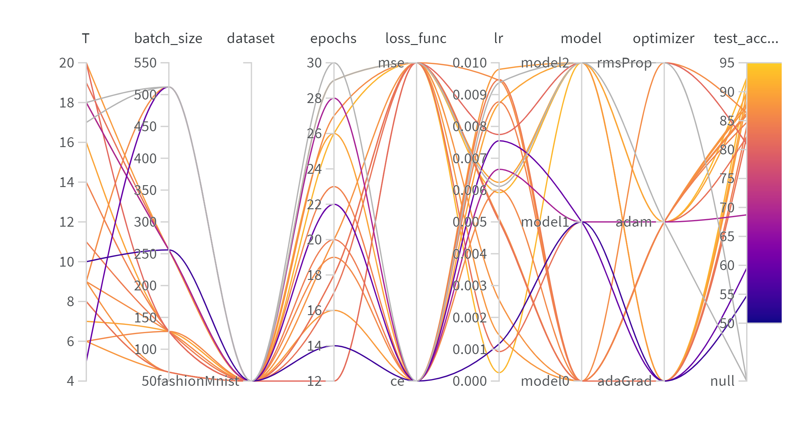
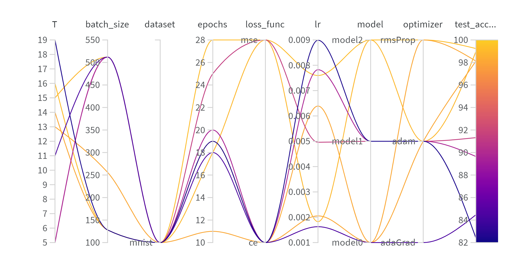

> HUSTAIA 2022 Spring
# SNN网络学习

## 任务目标
- 构建脉冲神经网络Spiking Neural Network(SNN)，完成分类任务，准确度超90%，并使用tensorboard实现实验结果可视化
- 更换新的数据集进行实验，得到训练和测试结果，并尝试在新的数据集上对已有实验结果进行优化，同时分析使用该数据集的意义
- 分析模型参数（学习率、优化方法、损失函数、网络层数等）对最终实验结果及精度的影响

## 实现模型
- snn.py: 两层层加入了LIF神经元的静态卷积层作为脉冲编码器+两层加入了LIF神经元的全连接层
- sigal_snn.py：泊松编码器+加入了LIF神经元的全连接层
- conv_snn.py：一层纯卷积层减少特征维数+一层加入了LIF神经元的卷积层作为脉冲编码器+两层加入了LIF神经元的全连接层

## 实验结果
在MNIST和FashionMNIST数据集上进行测试

详细结果可见[wandb](https://wandb.ai/polowitty/snn?workspace=user-polowitty)

mnist数据集上最高99.28%，fashionMnist数据集上最高92.37%，均为conv_snn达到

fashionMnist数据集上结果：

mnist数据集上结果：

